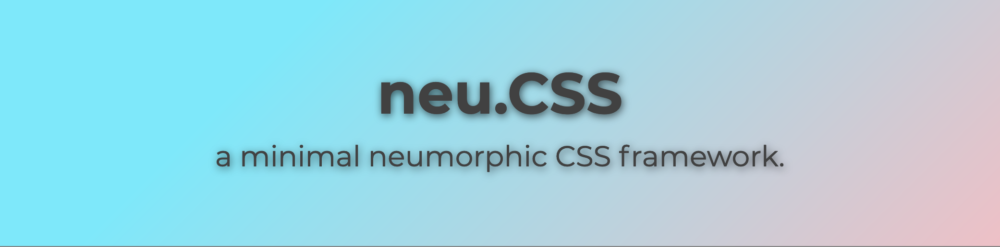

# neu.CSS



neu.CSS is a new minimal, modern CSS framework that incorporates many neumorphic elements to help bring your website and app a modern design. There is no JavaScript code required for the functionality of all components; however, some older browsers will not support some components. I am working on ensuring all functionality is compatible with all browsers released in the last 5 years.

## Quick Start

**_NOTE: I assume you are using this framework for HTML_**
To download neu.CSS and use it on your project, all you need to download is the file neu.CSS located in the assets folder. If you would like examples on how certain components are used with html code, you can take a look at the index.html file.

### Loading the CSS file on your existing project.

```
 <link rel="stylesheet" href="assets/neu.css" />
```

## Components

### Creating a button

#### Creating a regular button


```
Regular button:
<a href="" class="a-btn">
    Button Text
</a>

or

<button class="a-btn">
    Button Text
</button>
```
