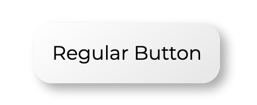
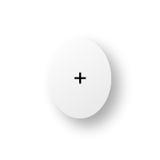
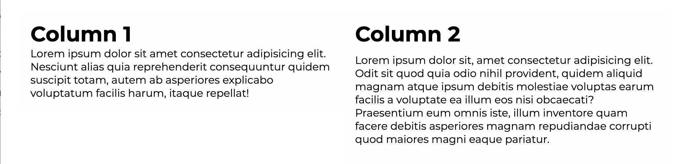
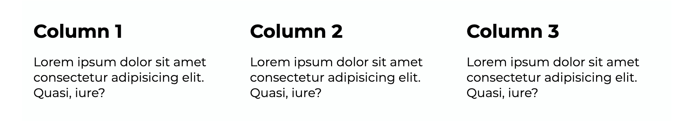

# neu.CSS


neu.CSS is a new minimal, modern CSS framework that incorporates many neumorphic elements to help bring your website and app a modern design. There is no JavaScript code required for the functionality of all components; however, some older browsers will not support some components. I am working on ensuring all functionality is compatible with all browsers released in the last 5 years.

## Quick Start

**_NOTE: I assume you are using this framework for HTML_**
To download neu.CSS and use it on your project, all you need to download is the file neu.CSS located in the assets folder. If you would like examples on how certain components are used with html code, you can take a look at the index.html file.

### Loading the CSS file on your existing project.

```
 <link rel="stylesheet" href="assets/neu.css" />
```

## Components

### Buttons

#### Regular Button



```
Regular button:
<a href="" class="a-btn">
    Button Text
</a>

or

<button class="a-btn">
    Button Text
</button>
```

#### Creating a round button



```
Round button:
<a href="" class="a-btn">
    Icon?
</a>

<button class="rnd-btn">
    Icon?
</button>

```

### Columns

neu.CSS is a responsive, mobile-friendly framework. All colunmns that you add will autoamtically convert to a single column layout when the screen size is less than 600px wide.

Notice that all column text is within a div with a class of padded, this is so that you can insert text, images, etc. without touching the other columns tect and images. This makes it possible for you to add backgrounds to columns and allows you to improve UI consistency.

#### Two Columns



```
Dual Columns:
      <div class="row">
        <div class="column-2">
          <div class="padded">
            <h1>Column 1</h1>
            Lorem ipsum dolor sit amet consectetur adipisicing elit. Nesciunt alias quia reprehenderit consequuntur quidem suscipit totam, autem ab asperiores explicabo voluptatum facilis harum, itaque repellat!
          </div>
        </div>
        <div class="column-2">
          <div class="padded">
            <h1>Column 2</h1>
            <p>Lorem ipsum dolor sit, amet consectetur adipisicing elit. Odit sit quod quia odio nihil provident, quidem aliquid magnam atque ipsum debitis molestiae voluptas earum facilis a voluptate ea illum eos nisi obcaecati? Praesentium eum omnis iste, illum inventore quam facere debitis asperiores magnam repudiandae corrupti quod maiores magni eaque pariatur.</p>
          </div>
        </div>
      </div>
```

#### Three Columns



```
Three Columns:

<div class="row">
    <div class="column-3">
        <div class="padded">
            <h2>Column 1</h2>
            <p>Lorem ipsum dolor sit amet consectetur adipisicing elit. Quasi, iure?</p>
        </div>
    </div>
    <div class="column-3">
        <div class="padded">
            <h2>Column 2</h2>
            <p>Lorem ipsum dolor sit amet consectetur adipisicing elit. Quasi, iure?</p>
        </div>
    </div>
    <div class="column-3">
        <div class="padded">
            <h2>Column 3</h2>
            <p>Lorem ipsum dolor sit amet consectetur adipisicing elit. Quasi, iure?</p>
        </div>
    </div>
</div>
```
